

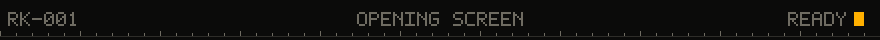

 

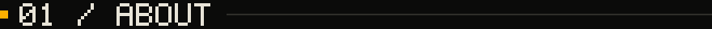

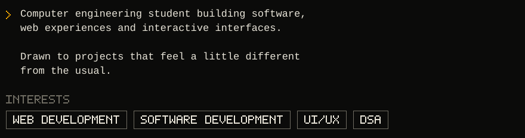

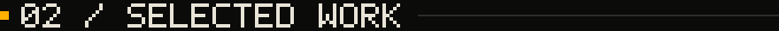

<a href="https://github.com/rudreshkumbhare/DSA-Visualizer">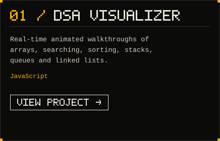</a>
<a href="https://github.com/rudreshkumbhare/UAV-altavia">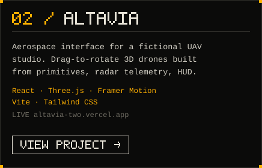</a>
<a href="https://github.com/rudreshkumbhare/Study-Focus-Tracker">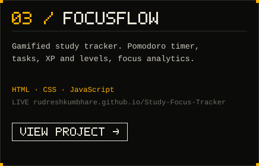</a>
<a href="https://github.com/rudreshkumbhare/Color-Palette-Studio">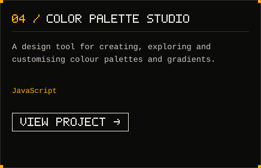</a>
<a href="https://github.com/rudreshkumbhare/dsa-assignments">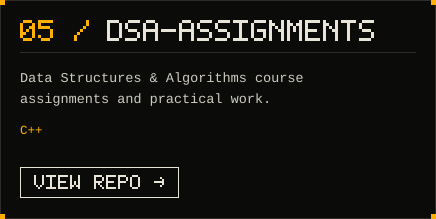</a>
<a href="https://github.com/rudreshkumbhare/devl-assignments">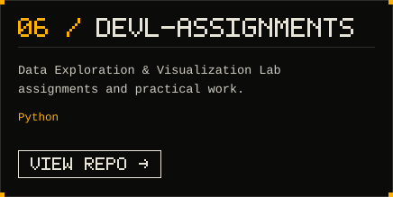</a>

 

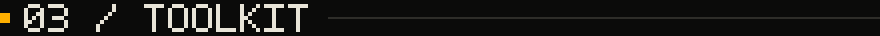

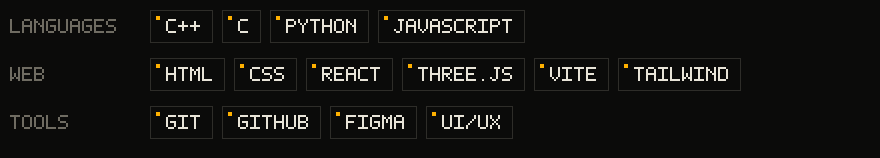

 

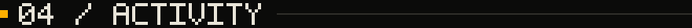

 

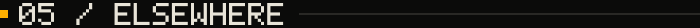

  

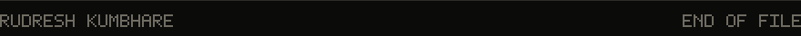

